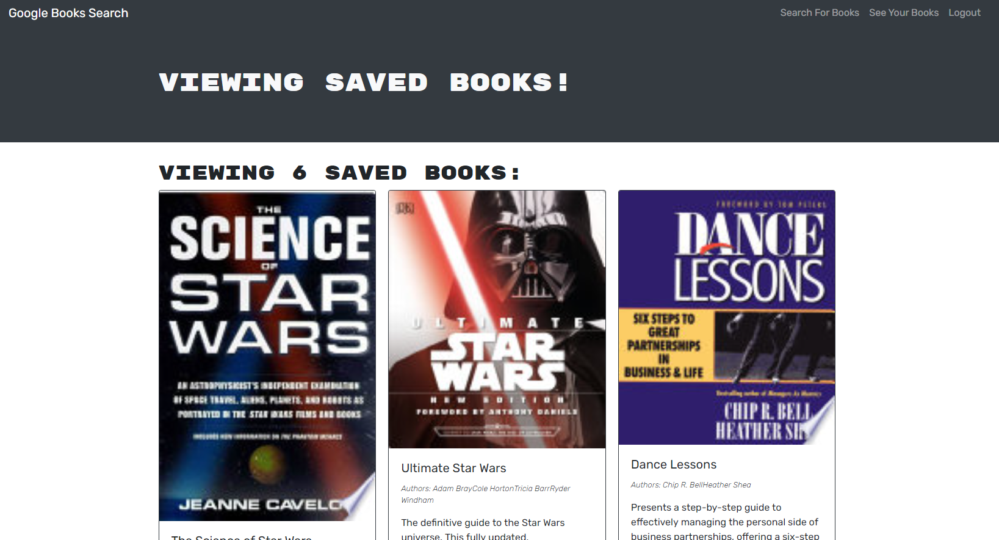

# Book Search Engine Starter Code

## Description
A M.E.R.N application that allows you to search for books using the Google Books API. Created with GraphQL and Apollo Client.

## Made With
React, JavaScript, Express, HTML, CSS, JSX, GraphQL, MongoDB, Apollo

## Deployed Demo Link
https://booksearchfrenzy.herokuapp.com/